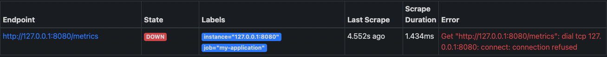
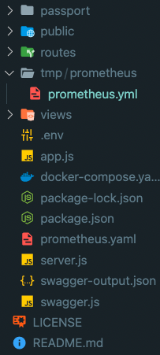

# ERROR

```jsx
ERROR: for prometheus  Cannot start service prometheus: Mounts denied:
The path /desktop/focus-with-me2/src/tmp/prometheus/prometheus.yml is not shared from the host and is not known to Docker.
You can configure shared paths from Docker -> Preferences... -> Resources -> File Sharing.
See https://docs.docker.com/desktop/mac for more info.
ERROR: Encountered errors while bringing up the project.
```

프로메테우스 적용 시켜 볼려고... 아침부터 도전..

2021 11 15 이 오류와 하루종일 싸움...

먼말이냐.. 파파고 gogo

```jsx
오류: 프로메테우스의 경우 프로메테우스를 시작할 수 없습니다. 마운트가 거부됨:
/desktop/focus-with-me2/src/tmp/prometeus/prometeus.yml 경로가 호스트에서 공유되지 않으며
도커에 알려져 있지 않습니다.
도커 -> 환경설정...에서 공유 경로를 구성할 수 있습니다. -> 리소스 -> 파일 공유.
자세한 내용은 https://docs.docker.com/desktop/mac을 참조하십시오.
오류: 프로젝트를 가져오는 동안 오류가 발생했습니다.
```

유투브 찾아보고 별 방법을 다 써봤다... 근데 git으로 받은 소스는 잘된다.... 머지...

도커도 먼지 모르겠다..

파일을 밖으로 빼서 커멘드 위치와 동일하게 맞춰서 멋잇게 docker-compose up -d prometheus 쳤는데..

```jsx
prometheus:
    container_name: prometheus
    image: prom/prometheus
    ports:
      - "9091:9090"
    command: --config.file=/etc/prometheus/prometheus.yaml
    volumes:
      - ./prometheus.yaml:/etc/prometheus/prometheus.yaml
```

뭐가 잘못일까... 도저히... 뭐 결과는 돌아가는데...



하 서버 돌아가는데 down이다.. 뭔가 잘못됫다..

volumes을 못읽어들이는거 같다.

다시 원상복구..



지금 파일 구조 ㅋㅋㅋ 어디에 넣고 해도 문제가 없다..

그래서 mac의 문제인가? 해서 찾아봤다.

[https://docs.docker.com/desktop/mac/](https://docs.docker.com/desktop/mac/) 이페이지도 가보고 도커 파일 경로도 설정 해봤다..

해결을 못한채... 내일 도커 volumes을 공부할꺼다..

### 2021-11-17

해결

- 경로 문제 및 mac 문제로 인해 ec2에서는 정상적으로 경로를 읽어드림.
- mac에서 docker의 Resources-File sharing 에서 경로 설정이 문제 였던거 같다.
