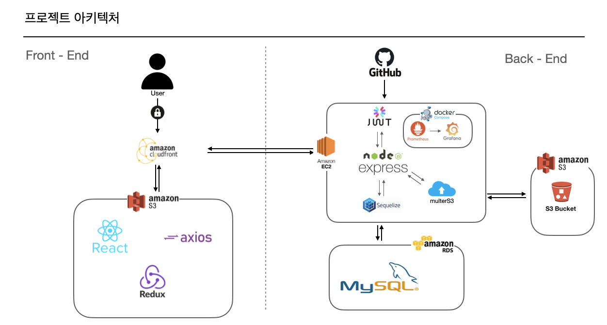

# 실전프로젝트 4조

# 렛츠끼리

### ❓ 프로젝트 개요 ❓

저희 프로젝트는 테스크 테리어 환경을 공유하는 웹 서비스입니다.

현대 사회에서 **‘책상’** 은 단순히 책을 올려놓고 공부하도록 하는 도구, 그 이상의 이미를 가집니다.

책상의 의미가 확장됨에 따라 **‘deskterior’** 라는 신조어가 생겨나고, 책상과 관련된 악세서리들이 생겨나고 있습니다.

책상에 앉아서 공부하는 사람들이 자신만의 집중 공간을 꾸미고 이를 **공유** 함으로서, 자기 표현의 **욕구충족**, 다른 사람들의 집중공간을 참고하여 **자신의 공간을 더 잘 꾸밀 수 있도록 하는 것** 이 우리의 프로젝트 목표입니다.

---

### 🎁 프로젝트 아키텍처 🎁

---

### 🤝 프론트엔드 주소 🤝

https://github.com/erionRK621/studyWithMe

---

### 대표 기술

- [passport(local,kakao,jwt)](https://github.com/JangJaeWon22/focus-with-me/blob/main/doc/skill-book/passport.md)
- [ckEditor5](https://github.com/JangJaeWon22/focus-with-me/blob/main/doc/skill-book/ckeditor.md)
- [Sequelize&MySQL](https://github.com/JangJaeWon22/focus-with-me/blob/main/doc/skill-book/sequelize&mysql/sequelize&mysql.md)
- [S3](https://github.com/JangJaeWon22/focus-with-me/blob/main/doc/skill-book/S3.md)
- [swagger](https://github.com/JangJaeWon22/focus-with-me/blob/main/doc/skill-book/swagger.md)
- [prometheus and grafana](https://github.com/JangJaeWon22/focus-with-me/blob/main/doc/skill-book/prometheus_and_grafana/prometheus_and_grafana.md)
- [winston and morgan](https://github.com/JangJaeWon22/focus-with-me/blob/main/doc/skill-book/winston&morgan/winston&morgan.md)
- [GitHub Action](https://github.com/JangJaeWon22/focus-with-me/blob/main/doc/skill-book/github_action.md)
- [Artillery-서버부화테스트](https://github.com/JangJaeWon22/focus-with-me/blob/main/doc/skill-book/Artillery/Artillery.md)

---

### 🐳 문제점과 해결 방법 🐳

refactoring-history

- [Daily-refactoring-history](https://github.com/JangJaeWon22/focus-with-me/tree/main/doc/refactoring-history)

---

### 🪞  느낀 점 🪞

#### - 계획과 계획과 계획

6주 동안 계획, 실천, 계획, 실천, 계획, 실천을 반복 한 것 같았습니다.
정말이지 작은 기능에도 엄청난 정성이 들어가는 거구나, 했습니다.
처음에는 서로서로 짝이 안맞는 라우터들이였지만, 나중엔 계획대로 합쳐보니, 너무 근사하게 묶여 있어서 행복했습니다.

#### - 일기를 쓰자!

물론 GitHub에서 제공 되는 것으로 관리가 되지만, 우리는 오늘 한 것을 일기 형식으로 기록 해보자, TIL을 쓰는 습관을 길러보자 했기 때문에, 매일매일 refactoring-history란에 오늘 변경된 코드나, 추가한 예외처리를 작성해서, 그에 대한 코드리뷰도 진행하는 형식으로 했습니다.
생각보다 많은 걸 느꼈습니다. "어제 어떤 기능을 바꿨는데, 현재 또 다른 기능을 추가했다. 하지만 저번에 바꿀때 했더라면 더 효율적이였을 것 같다" 등의 우리 팀원들이 한 단계 발전할 수 있는 반성의 장소가 되었던 것도 기억이 났습니다.

#### - 도전해보자!! 근데 누가?

여러 도전해보고 싶은 기능들이 많았지만, 현재의 서버 당직? 이라는 것을 통해 팀원 한명이 챌린지 중이라면 나머지 팀원들은 기존 기능을 보완하거나, 혹여 놓친 에러를 해결을 하려고 했기 때문에, 도전하는 기능을 빠르게 구현 할 수 있었던 것 같습니다.
대표적으로 프로메테우스와 그라파나, ckEditor, TypeScript, kakao login 등

#### - 뭐 부터 해야되지?

빠르게 흘러가는 시간을 주체 못하고, 멘탈이 붕괴 되어 우리가 지금 당장 뭘 해야되지, 밀려있는 일은 이정도 인데 효율적으로 협업을 하려면 뭐 부터 해야 될지가 문제 였습니다.

#### - 남은 시간은 N일, 현재 우리 작업은 N일동안 가능

남은 시간은 이정도인데, 현재 우리 작업은 언제 끝날지도 모르는 작업 속도에 지쳤습니다. 하지만, 집단지성의 힘이라고 해야되나.. 밤마다 코드리뷰와 리펙토링을 통해 급한 문제를 해결 할 수 있었고, 원하는 목표에 도달 할 수 있었던 것 같습니다.

#### - 기술서 작성

우리의 코드는 나중에 누가 보더라도 쓸 수 있게 코드리뷰를 빡시게 하자. 부터 시작을 했습니다.
어떻게 하는지 까먹더라도 구현 할 수 있어야 된다 라고 생각을 했고, 우리가 직접 작성했던 기술들을 우리 프로젝트에 어떻게 담아냈는지에 대한 기술서를 작성을 했습니다.
지금 아니라도 나중에 프로젝트 코드를 뜯어보면서 아 이렇게 적용했구나, 저렇게 적용했구나 할 수 있도록 현재의 코드리뷰를 꼼꼼히 하려고 노력했고, 우리 팀원들의 기술들을 어떻게 구현을 했는지에 대해 상세하게 적을려고 노력을 했습니다.
나중에 보더라도 누구나 구현 할 수 있도록 했기에 꼭 도움이 되었을꺼라 생각이 듭니다.
